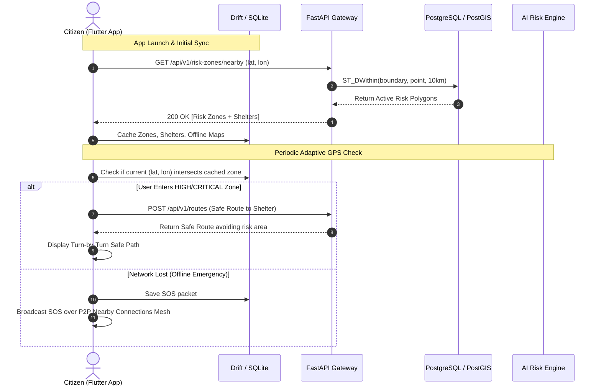
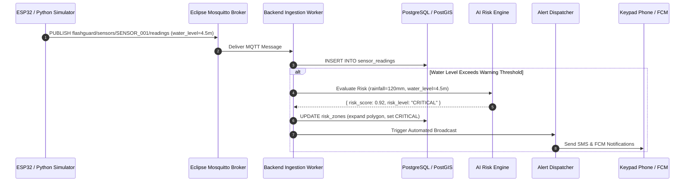
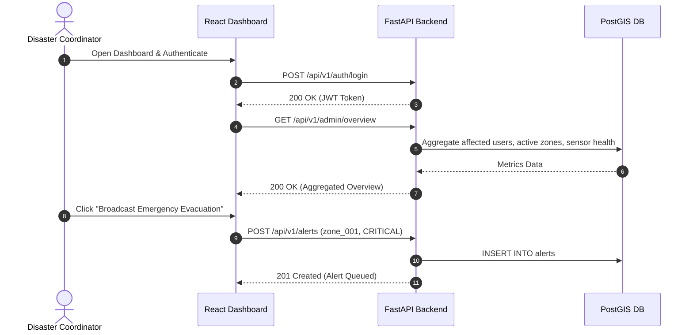

# FlashGuard AI — End-to-End Data Flows

## 1. Citizen Mobile Lifecycle

```mermaid
sequenceDiagram
    autonumber
    actor User as Citizen (Flutter App)
    participant LocalDB as Drift / SQLite
    participant Backend as FastAPI Gateway
    participant PostGIS as PostgreSQL / PostGIS
    participant AI as AI Risk Engine

    Note over User, LocalDB: App Launch & Initial Sync
    User->>Backend: GET /api/v1/risk-zones/nearby (lat, lon)
    Backend->>PostGIS: ST_DWithin(boundary, point, 10km)
    PostGIS-->>Backend: Return Active Risk Polygons
    Backend-->>User: 200 OK [Risk Zones + Shelters]
    User->>LocalDB: Cache Zones, Shelters, Offline Maps

    Note over User, AI: Periodic Adaptive GPS Check
    User->>LocalDB: Check if current (lat, lon) intersects cached zone
    alt User Enters HIGH/CRITICAL Zone
        User->>Backend: POST /api/v1/routes (Safe Route to Shelter)
        Backend-->>User: Return Safe Route avoiding risk area
        User->>User: Display Turn-by-Turn Safe Path
    else Network Lost (Offline Emergency)
        User->>LocalDB: Save SOS packet
        User->>User: Broadcast SOS over P2P Nearby Connections Mesh
    end
```

---

## 2. Sensor Telemetry & Automated Risk Assessment Flow

```mermaid
sequenceDiagram
    autonumber
    participant Sensor as ESP32 / Python Simulator
    participant MQTT as Eclipse Mosquitto Broker
    participant Ingestion as Backend Ingestion Worker
    participant DB as PostgreSQL / PostGIS
    participant AI as AI Risk Engine
    participant AlertEngine as Alert Dispatcher
    participant Phone as Keypad Phone / FCM

    Sensor->>MQTT: PUBLISH flashguard/sensors/SENSOR_001/readings (water_level=4.5m)
    MQTT->>Ingestion: Deliver MQTT Message
    Ingestion->>DB: INSERT INTO sensor_readings
    
    alt Water Level Exceeds Warning Threshold
        Ingestion->>AI: Evaluate Risk (rainfall=120mm, water_level=4.5m)
        AI-->>Ingestion: { risk_score: 0.92, risk_level: "CRITICAL" }
        Ingestion->>DB: UPDATE risk_zones (expand polygon, set CRITICAL)
        Ingestion->>AlertEngine: Trigger Automated Broadcast
        AlertEngine->>Phone: Send SMS & FCM Notifications
    end
```

---

## 3. Administrator & Incident Coordination Flow

```mermaid
sequenceDiagram
    autonumber
    actor Admin as Disaster Coordinator
    participant Dashboard as React Dashboard
    participant Backend as FastAPI Backend
    participant DB as PostGIS DB

    Admin->>Dashboard: Open Dashboard & Authenticate
    Dashboard->>Backend: POST /api/v1/auth/login
    Backend-->>Dashboard: 200 OK (JWT Token)
    Dashboard->>Backend: GET /api/v1/admin/overview
    Backend->>DB: Aggregate affected users, active zones, sensor health
    DB-->>Backend: Metrics Data
    Backend-->>Dashboard: 200 OK (Aggregated Overview)
    
    Admin->>Dashboard: Click "Broadcast Emergency Evacuation"
    Dashboard->>Backend: POST /api/v1/alerts (zone_001, CRITICAL)
    Backend->>DB: INSERT INTO alerts
    Backend-->>Dashboard: 201 Created (Alert Queued)
```
