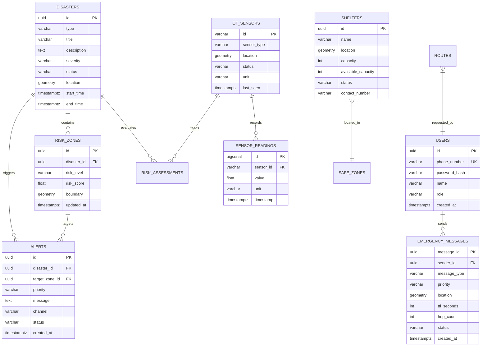

# FlashGuard AI — Database Schema & Data Models

## 1. Overview
FlashGuard AI uses **PostgreSQL 15+** with the **PostGIS** spatial extension. All geographic features are stored in the **WGS84 coordinate reference system (SRID 4326)** with spatial indexes (`GIST`) to support ultra-fast proximity and polygon intersection queries.

---

## 2. Entity-Relationship Model



---

## 3. Detailed Table Specifications

### 3.1 `users`
Stores registered citizens and administrative personnel.
```sql
CREATE TABLE users (
    id UUID PRIMARY KEY DEFAULT gen_random_uuid(),
    phone_number VARCHAR(20) UNIQUE NOT NULL,
    password_hash VARCHAR(255) NOT NULL,
    name VARCHAR(100) NOT NULL,
    role VARCHAR(20) NOT NULL DEFAULT 'USER', -- 'USER', 'ADMIN'
    fcm_token VARCHAR(255),
    created_at TIMESTAMPTZ NOT NULL DEFAULT NOW(),
    updated_at TIMESTAMPTZ NOT NULL DEFAULT NOW()
);

CREATE INDEX idx_users_phone ON users(phone_number);
```

### 3.2 `disasters`
Tracks reported and active emergency events.
```sql
CREATE TABLE disasters (
    id UUID PRIMARY KEY DEFAULT gen_random_uuid(),
    type VARCHAR(50) NOT NULL, -- 'FLOOD', 'LANDSLIDE', etc.
    title VARCHAR(200) NOT NULL,
    description TEXT,
    severity VARCHAR(20) NOT NULL, -- 'LOW', 'MEDIUM', 'HIGH', 'CRITICAL'
    status VARCHAR(20) NOT NULL DEFAULT 'ACTIVE', -- 'ACTIVE', 'RESOLVED'
    source VARCHAR(100) NOT NULL,
    location GEOMETRY(Point, 4326),
    start_time TIMESTAMPTZ NOT NULL,
    end_time TIMESTAMPTZ,
    created_at TIMESTAMPTZ NOT NULL DEFAULT NOW(),
    updated_at TIMESTAMPTZ NOT NULL DEFAULT NOW()
);

CREATE INDEX idx_disasters_location ON disasters USING GIST(location);
CREATE INDEX idx_disasters_status ON disasters(status);
```

### 3.3 `risk_zones`
Geospatial polygons delineating danger sectors with calculated risk scores.
```sql
CREATE TABLE risk_zones (
    id UUID PRIMARY KEY DEFAULT gen_random_uuid(),
    disaster_id UUID REFERENCES disasters(id) ON DELETE CASCADE,
    risk_level VARCHAR(20) NOT NULL, -- 'LOW', 'MEDIUM', 'HIGH', 'CRITICAL'
    risk_score FLOAT NOT NULL CHECK (risk_score >= 0.0 AND risk_score <= 1.0),
    boundary GEOMETRY(Polygon, 4326) NOT NULL,
    created_at TIMESTAMPTZ NOT NULL DEFAULT NOW(),
    updated_at TIMESTAMPTZ NOT NULL DEFAULT NOW()
);

CREATE INDEX idx_risk_zones_boundary ON risk_zones USING GIST(boundary);
CREATE INDEX idx_risk_zones_disaster ON risk_zones(disaster_id);
```

### 3.4 `safe_zones` & `shelters`
Relief centers and designated safe collection perimeters.
```sql
CREATE TABLE safe_zones (
    id UUID PRIMARY KEY DEFAULT gen_random_uuid(),
    name VARCHAR(150) NOT NULL,
    boundary GEOMETRY(Polygon, 4326),
    capacity INTEGER NOT NULL DEFAULT 0,
    status VARCHAR(20) NOT NULL DEFAULT 'ACTIVE',
    created_at TIMESTAMPTZ NOT NULL DEFAULT NOW()
);

CREATE TABLE shelters (
    id UUID PRIMARY KEY DEFAULT gen_random_uuid(),
    safe_zone_id UUID REFERENCES safe_zones(id) ON DELETE SET NULL,
    name VARCHAR(150) NOT NULL,
    location GEOMETRY(Point, 4326) NOT NULL,
    capacity INTEGER NOT NULL,
    available_capacity INTEGER NOT NULL,
    status VARCHAR(20) NOT NULL DEFAULT 'OPEN', -- 'OPEN', 'FULL', 'CLOSED'
    contact_number VARCHAR(20),
    created_at TIMESTAMPTZ NOT NULL DEFAULT NOW(),
    updated_at TIMESTAMPTZ NOT NULL DEFAULT NOW()
);

CREATE INDEX idx_shelters_location ON shelters USING GIST(location);
```

### 3.5 `hospitals`
Emergency medical facilities for medical routing.
```sql
CREATE TABLE hospitals (
    id UUID PRIMARY KEY DEFAULT gen_random_uuid(),
    name VARCHAR(150) NOT NULL,
    location GEOMETRY(Point, 4326) NOT NULL,
    emergency_beds_available INTEGER NOT NULL DEFAULT 0,
    contact_number VARCHAR(20),
    status VARCHAR(20) NOT NULL DEFAULT 'OPERATIONAL',
    created_at TIMESTAMPTZ NOT NULL DEFAULT NOW()
);

CREATE INDEX idx_hospitals_location ON hospitals USING GIST(location);
```

### 3.6 `iot_sensors` & `sensor_readings`
Environmental telemetry hardware and generated simulated sensor data.
```sql
CREATE TABLE iot_sensors (
    id VARCHAR(50) PRIMARY KEY, -- e.g., 'SENSOR_001'
    sensor_type VARCHAR(50) NOT NULL, -- 'WATER_LEVEL', 'RAINFALL', 'SOIL_MOISTURE'
    location GEOMETRY(Point, 4326) NOT NULL,
    unit VARCHAR(20) NOT NULL, -- 'meters', 'mm', '%'
    status VARCHAR(20) NOT NULL DEFAULT 'ONLINE', -- 'ONLINE', 'OFFLINE', 'MAINTENANCE'
    last_seen TIMESTAMPTZ NOT NULL DEFAULT NOW()
);

CREATE TABLE sensor_readings (
    id BIGSERIAL PRIMARY KEY,
    sensor_id VARCHAR(50) REFERENCES iot_sensors(id) ON DELETE CASCADE,
    value FLOAT NOT NULL,
    unit VARCHAR(20) NOT NULL,
    timestamp TIMESTAMPTZ NOT NULL DEFAULT NOW()
);

CREATE INDEX idx_readings_sensor_time ON sensor_readings(sensor_id, timestamp DESC);
```

### 3.7 `risk_assessments`
Historical record of risk engine outputs.
```sql
CREATE TABLE risk_assessments (
    id UUID PRIMARY KEY DEFAULT gen_random_uuid(),
    disaster_type VARCHAR(50) NOT NULL,
    zone_id UUID REFERENCES risk_zones(id) ON DELETE SET NULL,
    risk_score FLOAT NOT NULL,
    risk_level VARCHAR(20) NOT NULL,
    confidence FLOAT,
    features_payload JSONB NOT NULL,
    timestamp TIMESTAMPTZ NOT NULL DEFAULT NOW()
);

CREATE INDEX idx_assessments_timestamp ON risk_assessments(timestamp DESC);
```

### 3.8 `alerts`
Dispatched emergency broadcasts across all output channels.
```sql
CREATE TABLE alerts (
    id UUID PRIMARY KEY DEFAULT gen_random_uuid(),
    disaster_id UUID REFERENCES disasters(id) ON DELETE CASCADE,
    target_zone_id UUID REFERENCES risk_zones(id) ON DELETE SET NULL,
    priority VARCHAR(20) NOT NULL, -- 'LOW', 'NORMAL', 'HIGH', 'CRITICAL'
    message TEXT NOT NULL,
    channel VARCHAR(30) NOT NULL, -- 'FCM', 'SMS', 'P2P', 'LOCAL'
    status VARCHAR(20) NOT NULL DEFAULT 'DISPATCHED',
    created_at TIMESTAMPTZ NOT NULL DEFAULT NOW(),
    delivered_at TIMESTAMPTZ
);

CREATE INDEX idx_alerts_disaster ON alerts(disaster_id);
```

### 3.9 `emergency_messages`
SOS requests originating from smartphones or peer-forwarded via mesh.
```sql
CREATE TABLE emergency_messages (
    message_id UUID PRIMARY KEY,
    sender_id UUID REFERENCES users(id) ON DELETE SET NULL,
    message_type VARCHAR(50) NOT NULL, -- 'NEED_HELP', 'TRAPPED', etc.
    priority VARCHAR(20) NOT NULL DEFAULT 'CRITICAL',
    location GEOMETRY(Point, 4326) NOT NULL,
    accuracy_meters FLOAT,
    ttl_seconds INTEGER NOT NULL DEFAULT 3600,
    hop_count INTEGER NOT NULL DEFAULT 0,
    status VARCHAR(20) NOT NULL DEFAULT 'RECEIVED', -- 'RECEIVED', 'RESPONDING', 'RESOLVED'
    created_at TIMESTAMPTZ NOT NULL DEFAULT NOW()
);

CREATE INDEX idx_emergency_messages_loc ON emergency_messages USING GIST(location);
CREATE INDEX idx_emergency_messages_status ON emergency_messages(status);
```

### 3.10 `sms_recipients`
Target recipient registry (restricted to the single prototype keypad test case).
```sql
CREATE TABLE sms_recipients (
    recipient_id VARCHAR(50) PRIMARY KEY, -- 'TEST_KEYPAD_001'
    phone_number VARCHAR(20) NOT NULL,
    notes VARCHAR(100),
    is_active BOOLEAN NOT NULL DEFAULT TRUE,
    created_at TIMESTAMPTZ NOT NULL DEFAULT NOW()
);
```
